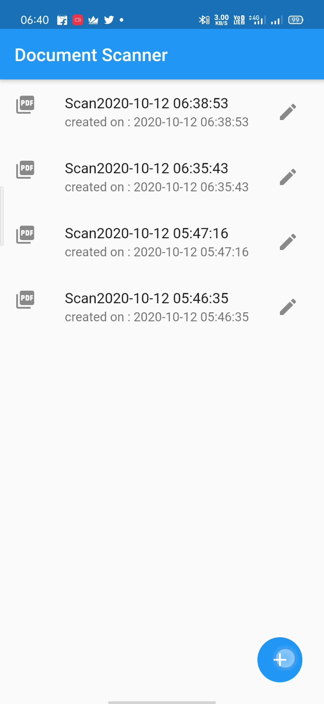
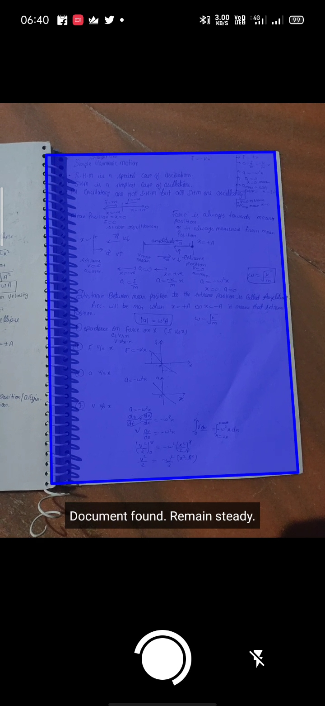
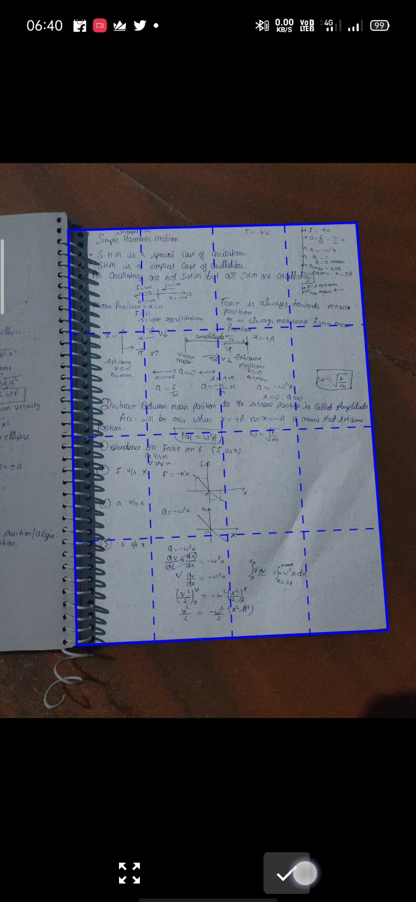
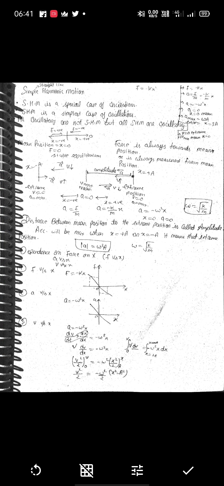
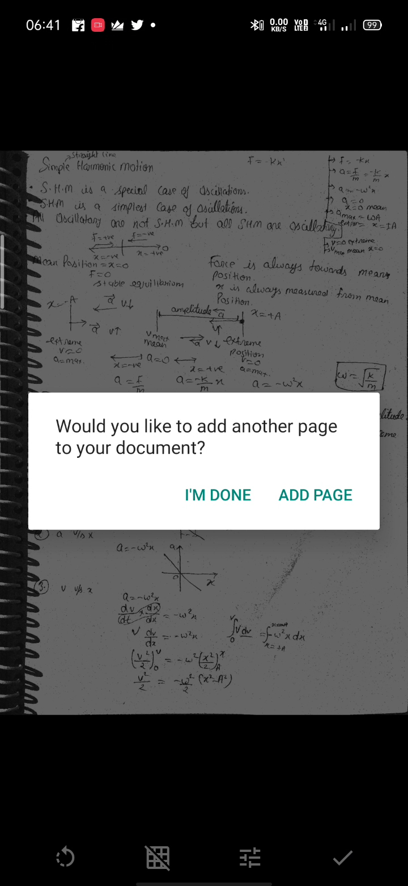
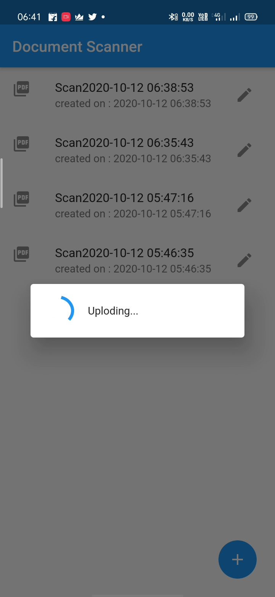
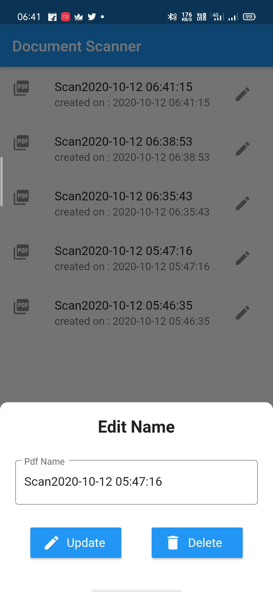
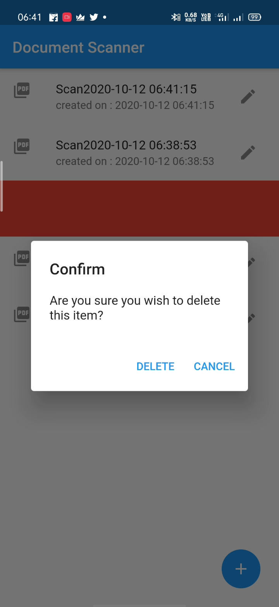

# Document Scanner(Flutter App)

This app turns your mobile into a portable scanner, which can be used for scanning handwritten notes and printed documents.
It automatically detect the edge of the paper over a contrasting surface.

In this app i used flutter_genius_scan plugin. We can easily scan signle/muliple documents by this app.After scanning, it saves pdf in google cloud storage and saves public url of that pdf in firestore database.

## Screen Shots
<text> </text>
    

